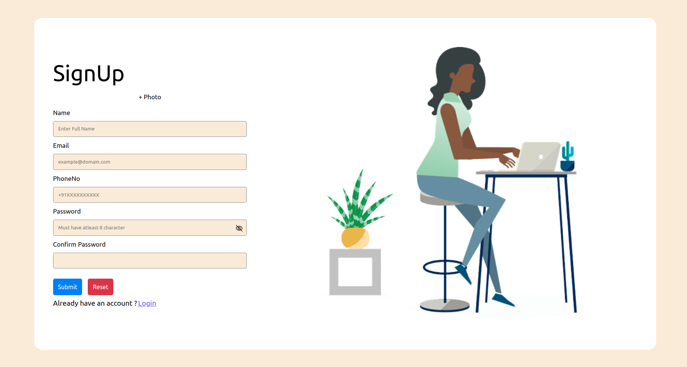
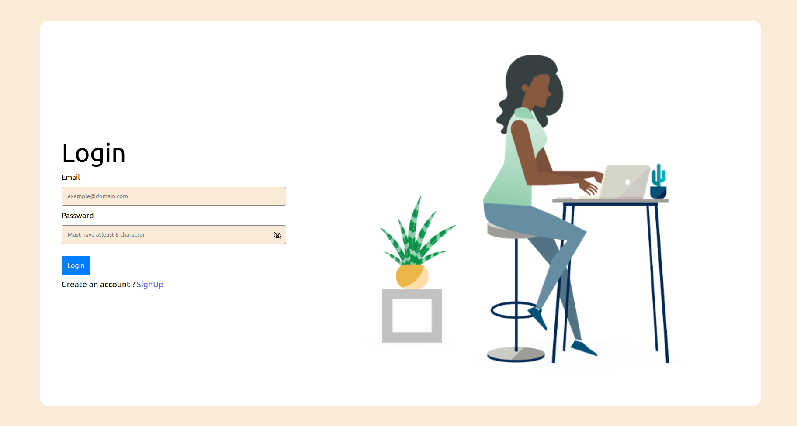
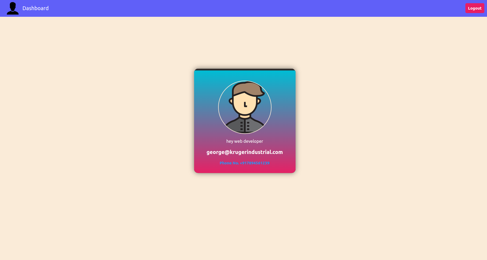

# User management app

- In the project, there are three main pages: Signup, Login, and Home.

> 1.  Signup Page:
>
> - This page is used for user registration.
> - The user provides their name, email,phone number and password.
> - Upon successful signup, the user is redirected to the Home page.

> 2.  Login Page:
>
> - This page is used for user authentication.
> - The user provides their email and password.
> - Upon successful login, the user is redirected to the Home page.
> - If the user is not registered yet, they have to first register using Signup page.

> 3.  Home Page:
>
> - It displays the content and features available to the authenticated user.
> - If the user is not logged in, they are redirected to the Login page.
> - If user press logout button then he redirected to signup page.

- In this I also add some of the validation like:
  > - Name: required, at least 15 char.
  > - email: validate email convention, required
  > - phoneNo: Indian phone no. is only valid, required
  > - password and confirm password should match and also
  > - the image should be of type jpg or png, or less than 2Mb

## 🚀 Live Demonstraion

- [User Managment App](https://thriving-moxie-bed4b2.netlify.app/)

## package used in this project

1. `formik` : Formik is a popular form library for React that helps with managing form state, validation, and form submission. It simplifies the process of building and handling forms in React applications.

```
npm install formik
```

2. `yup` : Yup is a JavaScript schema validation library that allows you to define validation rules for objects and perform validation checks on those objects. It is often used in conjunction with form libraries like Formik to handle form validation.

```
npm install yup
```

3. `react-toastify` : React Toastify is a popular library for displaying toast notifications in React applications. It provides an easy and customizable way to show informative messages or alerts to users.

```
npm install react-toastify
```

4. `@reduxjs/toolkit`: @reduxjs/toolkit is a package provided by Redux that simplifies the process of managing state in a Redux application. It includes several utilities and abstractions to streamline common Redux patterns and reduce boilerplate code.

```
npm install @reduxjs/toolkit
```

5. `react-redux` : react-redux is a package that provides the official bindings between React and Redux, allowing you to seamlessly integrate Redux state management into your React application. It provides a set of components and hooks that enable you to connect your React components to the Redux store and access the state and dispatch actions.

```
npm install react-redux
```

6. `react-router-dom` : react-router-dom is a popular package that provides routing capabilities for React applications. It allows you to handle client-side routing and navigation, enabling you to create multi-page applications with multiple routes and views.

```
npm install react-router-dom
```

## Snapshof of Project

## SignUp Page



## Login Page



## Home Page


